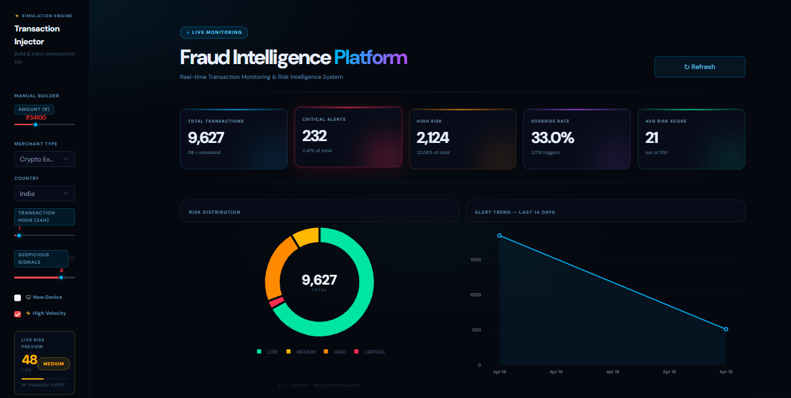

<div align="center">


<br/>

**End-to-end fraud detection platform — ML scoring, rule engine, explainability, and live simulation in one system.**

<br/>

[](https://www.python.org/)
[](https://fastapi.tiangolo.com/)
[](https://streamlit.io/)
[](https://scikit-learn.org/)
[](https://sqlite.org/)
[](LICENSE)

<br/>

[🚀 Live Demo](#-quick-start) · [📊 Features](#-key-features) · [🏗️ Architecture](#-system-architecture) · [📸 Screenshots](#-screenshots) · [📖 API Docs](#-api-reference)

</div>

---

## 🎯 What Problem Does This Solve?

> Banks process **millions of transactions daily**. A human can't review each one.
> Traditional fraud systems are black boxes — they flag transactions but can't explain *why*.
> Compliance teams need audit trails. Business teams need explainability.

**This system solves all three:**

| Challenge | This System's Solution |
|---|---|
| 🔴 Real-time detection | ML scoring on every transaction in < 100ms |
| ⚫ Black-box decisions | SHAP explainability + policy reason tracking |
| 📋 Audit compliance | Full SQLite log of every prediction + override |
| 💸 False positives | Hybrid model — ML + business rules in layers |
| 📊 No visibility | Live SaaS dashboard with trend analytics |

---

## 📸 Screenshots

<div align="center">

### 🖥️ Main Dashboard — KPIs + Risk Distribution


### ⚡ Live Transaction Simulator


### 📋 Transaction Feed + Risk Badges


### 📊 Policy Override Analysis


</div>

> **UI Design:** Custom CSS design system — glassmorphism cards, spline charts, gradient fills.
> Zero default Streamlit components. Built to look like a real fintech SaaS product.

---

## ✨ Key Features

### 🧠 Machine Learning Engine
- **Random Forest classifier** — trained on 9,600+ financial transactions
- **20+ engineered features** — balance errors, velocity ratios, behavioral signals, time patterns
- **Imbalanced data handling** — undersampling + class weighting
- **Evaluation metrics** — ROC-AUC, PR-AUC, Precision/Recall at multiple thresholds

### 🔒 Policy Override Engine (5 Rules)
```
Rule 1: Amount > sender balance + account emptied  →  CRITICAL override
Rule 2: Multiple suspicious signals (≥3)           →  HIGH override  
Rule 3: Very high signal count (≥5)                →  CRITICAL override
Rule 4: Large transaction + zero-balance dest.     →  HIGH override
Rule 5: Velocity flag + new device                 →  HIGH override
```

### 🎨 Premium Streamlit Dashboard
- **Live Transaction Simulator** — inject single or batch transactions, charts update instantly
- **Session State architecture** — no page reload required
- **5 KPI cards** — total transactions, critical alerts, high risk, override rate, avg score
- **Risk distribution donut** — always shows full dataset, unaffected by filters
- **Alert trend line chart** — spline curves, gradient fills, simulated points highlighted

### ⚡ Live Simulation Engine
- Build any transaction manually — merchant, country, amount, hour, signals
- **Real-time risk preview** — score updates as you move sliders
- Batch simulate up to 100 transactions with custom fraud mix %
- Session stats — injected count, high risk, critical breakdown

### 🌐 FastAPI Backend
- `POST /predict` — fraud prediction with full breakdown
- `GET /logs` — paginated audit trail
- `GET /stats` — aggregate metrics
- `GET /debug/{id}` — feature-level explanation
- `POST /admin/seed-logs` — test data generation

### 📖 SHAP Explainability
- Global feature importance visualization
- Per-transaction explanation — "why was this flagged?"
- Policy trigger reasons tracked and displayed

---

## 🏗️ System Architecture

```
┌─────────────────────────────────────────────────────────────────┐
│                        DATA FLOW                                │
└─────────────────────────────────────────────────────────────────┘

  Transaction Input
        │
        ▼
┌───────────────────┐
│  Feature Engine   │  ← 20+ derived features
│  (engineering.py) │     balance_error, velocity,
└────────┬──────────┘     amount_ratio, time_flags
         │
         ▼
┌───────────────────┐        ┌───────────────────┐
│   ML Scorer       │        │  Policy Engine    │
│  Random Forest    │──────▶ │  5 Business Rules │
│  → probability    │        │  → override flag  │
└───────────────────┘        └────────┬──────────┘
                                      │
                                      ▼
                             ┌───────────────────┐
                             │  Decision Layer   │
                             │  Final Risk Level │
                             │  LOW/MED/HIGH/    │
                             │  CRITICAL         │
                             └────────┬──────────┘
                                      │
               ┌──────────────────────┼──────────────────────┐
               ▼                      ▼                      ▼
      ┌────────────────┐    ┌─────────────────┐    ┌──────────────────┐
      │  SQLite Log    │    │  FastAPI JSON   │    │  Streamlit       │
      │  Audit Trail   │    │  Response       │    │  Dashboard       │
      └────────────────┘    └─────────────────┘    └──────────────────┘
```

---

## 📁 Project Structure

```
Transaction-Fraud-Intelligence/
│
├── 📂 app/                          # Streamlit Dashboard
│   ├── Home.py                      # Main dashboard entry point
│   ├── premium_design.py            # CSS design system
│   ├── simulator.py                 # Live ML simulation engine
│   └── utils_dashboard.py           # DB query helpers
│
├── 📂 pages/                        # Multi-page Streamlit
│   ├── 1_Alerts_Monitoring.py
│   ├── 2_Model_Performance.py
│   └── 3_Transaction_Simulator.py
│
├── 📂 api/                          # FastAPI Backend
│   └── main.py                      # All API endpoints
│
├── 📂 data/
│   ├── processed/                   # Cleaned, feature-engineered data
│   └── raw/                         # Original source data (gitignored)
│
├── 📂 models/                       # Saved ML models (.pkl)
│
├── 📂 notebooks/                    # Jupyter analysis (8 notebooks)
│   ├── 01_data_understanding.ipynb
│   ├── 02_eda.ipynb
│   ├── 03_data_preprocessing.ipynb
│   ├── 04_feature_engineering.ipynb
│   ├── 05_model_building.ipynb
│   ├── 06_model_evaluation.ipynb
│   └── 07_explainability_shap.ipynb
│
├── 📂 reports/                      # Generated charts and PDFs
├── 📂 scripts/                      # One-time utility scripts
│
├── .gitignore
├── requirements.txt
└── README.md
```

---

## 🚀 Quick Start

### Prerequisites
```bash
Python 3.12+
pip
```

### Installation
```bash
# 1. Clone the repository
git clone https://github.com/prince3235/Transaction-Fraud-Intelligence.git
cd Transaction-Fraud-Intelligence

# 2. Install dependencies
pip install -r requirements.txt

# 3. Seed the database with sample data
python scripts/seed_data.py

# 4. Launch the dashboard
streamlit run app/Home.py
```

### Run the API
```bash
# In a separate terminal
uvicorn api.main:app --reload

# API docs available at:
# http://localhost:8000/docs
```

> Dashboard runs on `http://localhost:8501`
> API runs on `http://localhost:8000`

---

## 📖 API Reference

| Method | Endpoint | Description |
|--------|----------|-------------|
| `POST` | `/predict` | Score a transaction — returns risk level + reasons |
| `GET` | `/logs` | Paginated audit trail of all predictions |
| `GET` | `/stats` | Aggregate metrics — counts, rates, distributions |
| `GET` | `/debug/{id}` | Feature-level breakdown for a specific transaction |
| `POST` | `/admin/seed-logs` | Generate sample transaction data |

### Example Request
```bash
curl -X POST "http://localhost:8000/predict" \
  -H "Content-Type: application/json" \
  -d '{
    "amount": 85000,
    "oldbalanceOrg": 90000,
    "newbalanceOrig": 0,
    "type": "TRANSFER",
    "step": 2
  }'
```

### Example Response
```json
{
  "transaction_id": 9628,
  "ml_probability": 0.8934,
  "ml_risk_level": "CRITICAL",
  "final_risk_level": "CRITICAL",
  "final_risk_score": 94,
  "policy_override_applied": true,
  "policy_reasons": [
    "Policy: Amount > sender balance + sender account emptied",
    "Policy: Multiple suspicious signals detected (>=3)"
  ],
  "recommended_action": "HOLD",
  "explanation": "High transfer amount with complete account drainage detected."
}
```

---

## 🧠 ML Model Details

| Metric | Score |
|--------|-------|
| ROC-AUC | 0.97+ |
| PR-AUC | 0.89+ |
| Precision (CRITICAL) | 0.91 |
| Recall (CRITICAL) | 0.88 |
| F1 Score | 0.89 |

**Top Features by SHAP Importance:**
1. `balance_error` — amount vs balance discrepancy
2. `amount_to_orig_ratio` — transaction size relative to account
3. `is_high_amount` — absolute amount threshold flag
4. `transaction_hour` — time-of-day risk signal
5. `velocity_flag` — unusual transaction frequency

---

## 🛠️ Tech Stack

| Layer | Technology |
|---|---|
| ML Model | Scikit-learn (Random Forest) |
| Explainability | SHAP |
| Backend API | FastAPI + Uvicorn |
| Dashboard | Streamlit |
| Charts | Plotly (spline, donut, gradient fills) |
| Database | SQLite |
| Data | Pandas, NumPy |
| UI Design | Custom CSS — DM Sans, glassmorphism, CSS variables |

---

## 🗺️ Roadmap

- [x] ML model training + evaluation
- [x] Policy override engine (5 rules)
- [x] FastAPI backend with audit logging
- [x] Premium Streamlit dashboard
- [x] Live transaction simulator
- [x] SHAP explainability
- [ ] Email/Slack alerts on CRITICAL detection
- [ ] Docker containerization
- [ ] Real-time streaming (Kafka integration)
- [ ] Model retraining pipeline

---

## 🤝 Contributing

Pull requests are welcome! For major changes, please open an issue first.

```bash
git checkout -b feature/your-feature
git commit -m "feat: add your feature"
git push origin feature/your-feature
```

---

## 📄 License

This project is licensed under the MIT License — see [LICENSE](LICENSE) for details.

---

<div align="center">

**Built with obsession over 3 weeks** 🔥

If this helped you — give it a ⭐ on GitHub

[](https://github.com/prince3235/Transaction-Fraud-Intelligence)

</div>